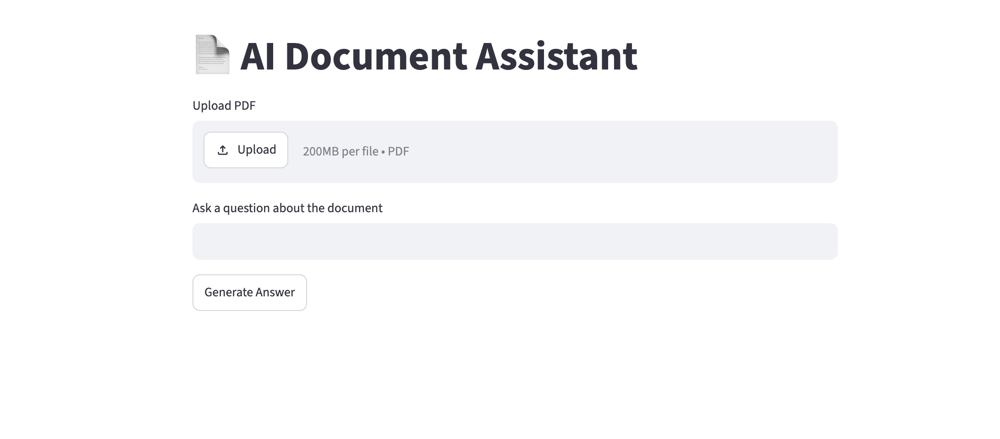
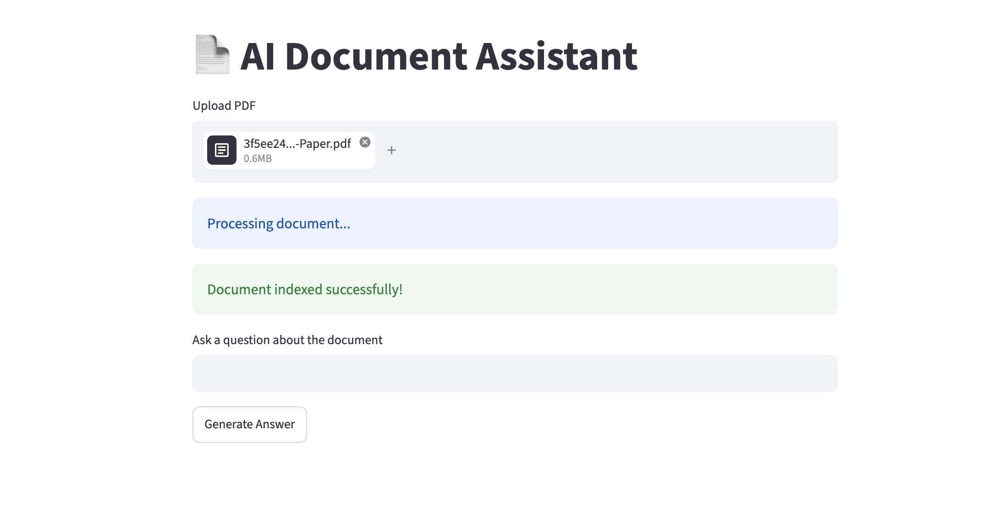
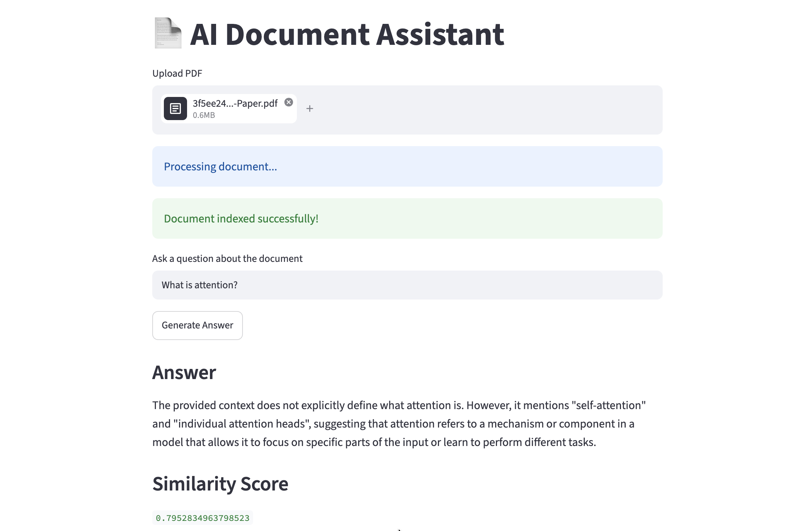

# 📄 LLM Document Agent

An AI-powered document analysis application built with **Streamlit**, **Sentence Transformers**, **FAISS**, and **Groq LLM**. The application enables users to upload documents, perform semantic search, ask questions in natural language, and generate intelligent summaries using Retrieval-Augmented Generation (RAG).

---

## 🚀 Features

- 📄 Upload PDF documents
- 🔍 Extract and preprocess document text
- ✂️ Automatic text chunking
- 🧠 Generate semantic embeddings using Sentence Transformers
- 📚 Store embeddings locally using FAISS
- 💬 Ask questions about uploaded documents
- 🤖 Answer generation using Groq LLM
- ⚡ Fast semantic retrieval with vector search
- 🌐 Simple Streamlit interface
- 🔐 Secure API key management using Streamlit Secrets

---

## 🏗️ Project Structure

```text
llm-document-agent/
│
├── app.py
├── requirements.txt
├── .env
├── .gitignore
├── README.md
│
├── app/
│   ├── agents/
│   │   └── llm_agent.py
│   ├── database/
│   │   └── faiss_db.py
│   ├── routes/
|   |   ├── upload.py
│   │   └── query.py
│   ├── services/
|   |   ├── document_pipeline.py
|   |   ├── embeddings.py
|   |   ├── evaluator.py
|   |   ├── parser.py
|   |   ├── rag_pipeline.py
|   |   ├── retriever.py
|   |   ├── similarity.py
│   │   └── store_vectors.py
│   └── utils/
|       └── chunking.py
│
└── documents/
```

---

# ⚙️ Technologies Used

| Technology | Purpose |
|------------|----------|
| Python | Programming Language |
| Streamlit | Web Application |
| FastAPI | Backend |
| Groq | Large Language Model API |
| Sentence Transformers | Embedding Generation |
| FAISS | Vector Database |
| PyPDF | PDF Parsing |
| NumPy | Numerical Operations |

---

# 📦 Installation

Clone the repository

```bash
git clone https://github.com/yourusername/llm-document-agent.git

cd llm-document-agent
```

Create virtual environment

```bash
python -m venv venv
```

Activate virtual environment

### Windows

```bash
venv\Scripts\activate
```

### Linux / macOS

```bash
source venv/bin/activate
```

Install dependencies

```bash
pip install -r requirements.txt
```

---

# 🔑 Environment Variables

Create a `.env` file

```env
GROQ_API_KEY=your_groq_api_key
```

or if deploying on **Streamlit Cloud**

Go to

```
Settings
↓
Secrets
```

Add

```toml
GROQ_API_KEY="your_groq_api_key"
```

---

# ▶️ Run Locally

```bash
streamlit run app.py
```

Application will be available at

```
http://localhost:8501
```

---

# ☁️ Deployment on Streamlit Cloud

1. Push project to GitHub

2. Login to Streamlit Cloud

3. Create New App

4. Select repository

5. Main file

```
app.py
```

6. Add Secrets

```toml
GROQ_API_KEY="your_api_key"
```

7. Deploy

---

# 📝 Supported File Formats

- PDF (.pdf)

---

# 🔍 How It Works

```text
Upload Document
        │
        ▼
Text Extraction
        │
        ▼
Chunk Generation
        │
        ▼
Sentence Embeddings
        │
        ▼
FAISS Vector Store
        │
        ▼
Semantic Retrieval
        │
        ▼
Groq LLM
        │
        ▼
Generated Response
```

---

# 🧠 Retrieval-Augmented Generation (RAG)

The application follows a standard RAG pipeline:

1. Upload document
2. Extract document text
3. Split into chunks
4. Generate embeddings
5. Store embeddings in FAISS
6. Retrieve relevant chunks
7. Pass retrieved context to Groq LLM
8. Generate grounded response

---

# 📊 Dependencies

Main libraries used

```text
streamlit
sentence-transformers
transformers
torch
torchvision
faiss-cpu
pypdf
groq
numpy
python-dotenv
requests
```

---

# 📷 Screenshots







---

# 💡 Future Improvements

- OCR support
- Multi-document chat
- Conversation memory
- Image understanding
- Audio transcription
- Citation generation
- Cloud vector database
- User authentication
- Document comparison
- PDF report export

---

# 🤝 Contributing

Contributions are welcome.

1. Fork the repository

2. Create your feature branch

```bash
git checkout -b feature-name
```

3. Commit your changes

```bash
git commit -m "Added new feature"
```

4. Push to branch

```bash
git push origin feature-name
```

5. Open a Pull Request

---

# 🐛 Known Issues

- Large documents may require additional processing time.
- Free Groq API tier has rate limits.
- FAISS vector store is stored locally.

---

# 📜 License

This project is licensed under the MIT License.

---

# 👨‍💻 Author

**Vikram Solanki**

LinkedIn: https://linkedin.com/in/your-profile

GitHub: https://github.com/yourusername

---

## ⭐ If you found this project helpful, please consider giving it a Star on GitHub!
